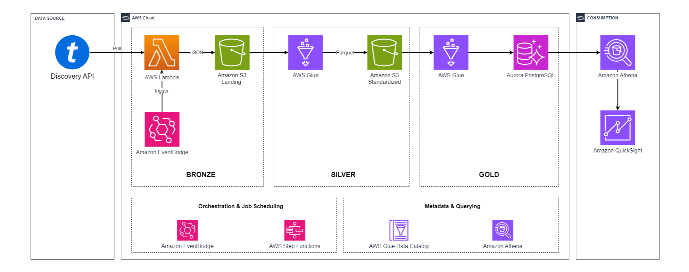

# Ticketmaster API - Data Engineer ETL Pipeline

This repository showcases an ETL pipeline designed to extract, transform, and load data from the Ticketmaster Discovery API into a structured format suitable for analytics and reporting.

## Table Contents

I. [Architecture Overview](#architecture-overview) \
 &nbsp; &nbsp; i.    [Business Insights](#business-insights) \
 &nbsp; &nbsp; ii.   [Key Features](#key-features) \
 &nbsp; &nbsp; iii.  [Technology](#technology) \
 &nbsp; &nbsp; iv.   [ETL Process](#etl-process) \
 &nbsp; &nbsp; v.    [Data Schema](#data-schema)

II. [Prerequisites](#prerequisites) \
III. [Getting Started](#getting-started) 

## Architecture Overview



### Business Insights

- What are the most popular events in a specific region or city?
- What types of events (e.g., concerts, sports, theater) are most common in different locations?
- What are the average ticket prices for different types of events?
- How do ticket prices vary across different venues?
- Which venues host the most events?

### Key Features

- **Serverless Architecture:** The pipeline is fully serverless, leveraging AWS managed services to ensure scalability, reliability, and cost efficiency.
  
- **Medallion Architecture:** Pattern commonly used in modern data lakes to organize and manage data in layers(Bronze, Silver, and Gold), allows for the incremental refinement of data from raw to more valuable states, making it easier to manage, process, and derive insights.

- **Data Lake Integration:** Combines the flexibility of an S3-based data lake with the structured querying capabilities.

- **Orchestrated Workflow:** Automated scheduling and error handling through EventBridge and Step Functions.

- **Advanced Reporting:** Integration with Amazon QuickSight allows for rich data visualization and reporting.

### Technology

- **Ticketmaster Discovery API:** The source of event data. This API is polled periodically to retrieve new or updated event information.
  
- **AWS Lambda:** Pulls data from the API and deposits raw JSON data into the S3 landing bucket.
  
- **Amazon S3 (Landing, Standardized):** S3 is used as the data lake, with a landing bucket for raw data, a standardized bucket for processed data stored in Parquet format, and a finalized bucket for further reporting and analytics.

- **AWS Glue:** Handles the transformation of raw JSON data into a standardized Parquet format. It also manages the ETL jobs to move data between S3 buckets and loads the data into final destination.

- **Amazon Athena:** Allows querying of the data stored in S3 using standard SQL. This is particularly useful for exploratory data analysis.

- **Amazon QuickSight:** Provides visualization and reporting capabilities, allowing business users to gain insights from the data.

- **Amazon EventBridge & AWS Step Functions:** These services are used for orchestration and scheduling of the ETL jobs, ensuring data is processed and available in a timely manner.

### ETL Process

- **Data Extraction:** AWS Lambda is triggered periodically by Amazon EventBridge to pull data from the Ticketmaster Discovery API.
- **Data Landing:** The raw JSON data is stored in an S3 bucket (Bronze Layer).
- **Data Transformation:** AWS Glue jobs transform the raw data into a standardized Parquet format and store it in another S3 bucket (Silver Layer).
- **Data Loading:** Transformed data is loaded into Gold Layer for structured querying and reporting.
- **Data Consumption:** Using Amazon Athena and QuickSight, the data is made available for querying and visualization.

### Data Schema

| Column Name                    | Data Type | Nullable |
|--------------------------------|-----------|----------|
| event_id                       | string    | true     |
| event_name                     | string    | true     |
| event_url                      | string    | true     |
| locale                         | string    | true     |
| event_date                     | string    | true     |
| event_sales_start_date         | string    | true     |
| event_sales_end_date           | string    | true     |
| venue_id                       | string    | true     |
| venue_name                     | string    | true     |
| venue_address                  | string    | true     |
| venue_city                     | string    | true     |
| venue_state                    | string    | true     |
| venue_country                  | string    | true     |
| venue_postal_code              | string    | true     |
| venue_latitude                 | string    | true     |
| venue_longitude                | string    | true     |
| seatmap_url                    | string    | true     |
| promoter_name                  | string    | true     |
| promoter_id                    | string    | true     |
| parking_info                   | string    | true     |
| segment_id                     | string    | true     |
| segment_name                   | string    | true     |
| genre_id                       | string    | true     |
| genre_name                     | string    | true     |
| subGenre_id                    | string    | true     |
| subGenre_name                  | string    | true     |
| type_id                        | string    | true     |
| type_name                      | string    | true     |
| subType_id                     | string    | true     |
| subType_name                   | string    | true     |
| price_currency                 | string    | true     |
| min_price                      | double    | true     |
| max_price                      | double    | true     |
| box_office_phone_number        | string    | true     |
| box_office_open_hours          | string    | true     |
| box_office_accepted_payment    | string    | true     |
| box_office_will_call_detail    | string    | true     |


## Prerequisites

To deploy this pipeline, you need the following:

- An AWS account with the necessary permissions.
- Access to the Ticketmaster Discovery API.
- AWS CLI or SDK configured.

## Getting Started

1. **Clone the repository:**
   ```bash
   git clone https://github.com/hdangle31/ETL-Ticketmaster-AWS.git

